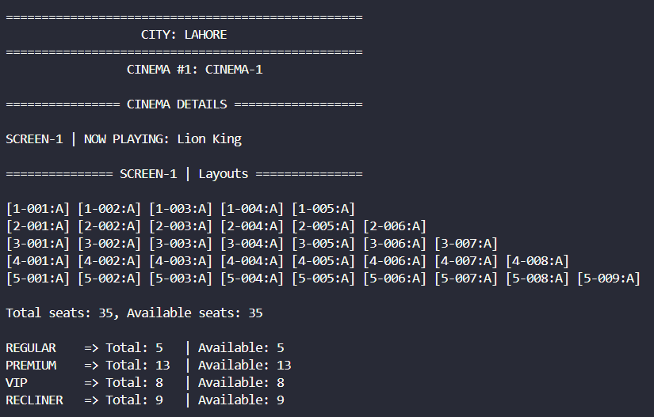
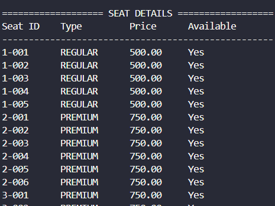
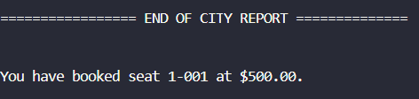
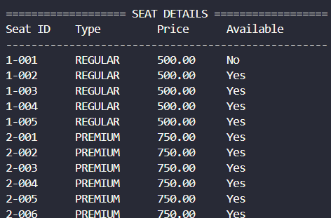

# Cinema Management System

## Overview

A Java program developed to manage cinema operations including movie listings and ticket management.

 

## Features

- Movie management
- Ticket booking
- Customer records
- Scheduling

## Technologies

- Java
- OOP

## Future Improvements

- Database
- GUI improvements
- Online booking
